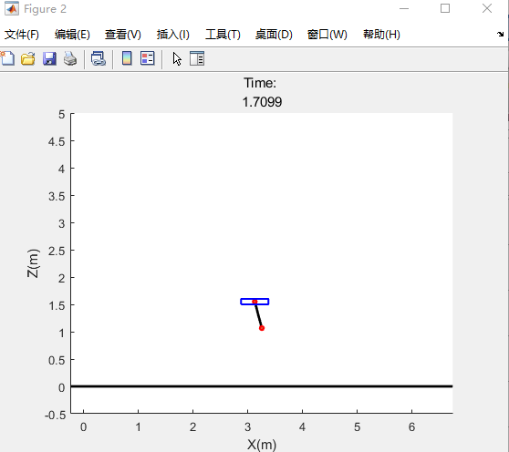
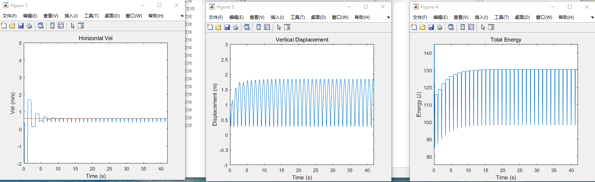

This project is a term-end project of Postgraduate-level robotics class: Advaced Robotics.
Project Name: One-leg hopping robot
About: Dynamics, Simulation, Forward-speed control
Code: MATLAB

User Guide:
1. Open control_UI.fig with guide in MATLAB.
2. Input your desired forward velocity. (between v ∈ [0,1.9] m/s)
3. Get animation and plots.

Snapshot:

